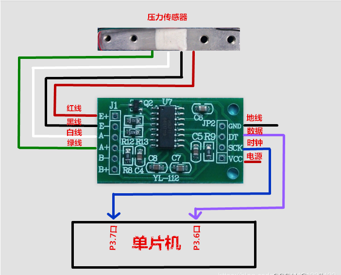
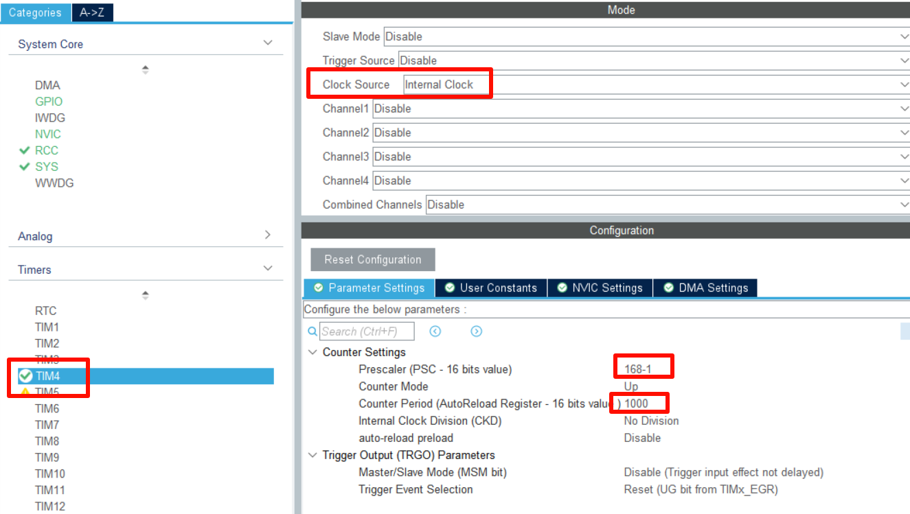
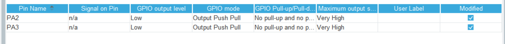

## HX711模块HAL版本

获取HX711的值，并转化为实际重量

## 配置

### 库

hal

### 硬件与接线

主控以stm32f407ve为例

| HX711                                          | 接线                                           |
| ---------------------------------------------- | ---------------------------------------------- |
|  |  |

### cubemx配置:（可选）

- 需要使用一个定时器提供us级定时



- gpio方面需要两个管脚作为DAT和SCK



## 快速使用

### 头文件需要更改

根据你的需求修改管脚

### 初始化

```C
HX711_Init();
Get_Maopi();  //可选
```

### 使用
```C
value = voidGet_Weight(void);
```


## 注意与引用

-2024/10/24

由于每个传感器的体质不同，头文件的GapValue根据实际情况修改

目前该模块还有待优化
