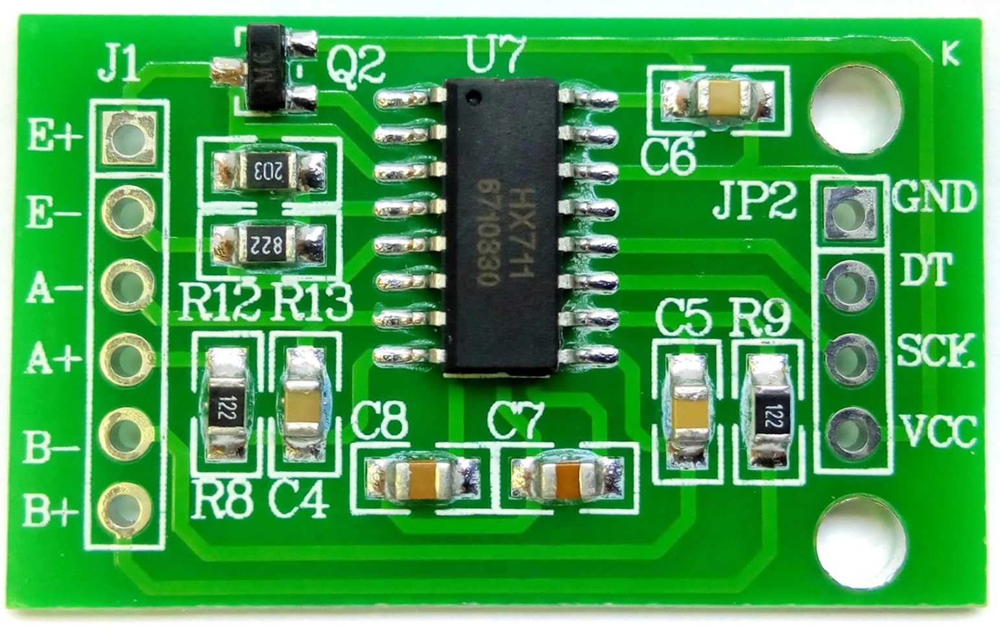

## HX711模块HAL版本

获取HX711的值，并转化为实际重量

## 配置

### 库

hal

### 硬件

hx711

stm32f407ve

### cubemx配置:（可选）

无

## 快速使用

### 头文件需要更改

根据你的需求修改管脚

### 接线

暂无

### 初始化

`voidHX711_Init(void);`

### 使用

  `value = voidGet_Weight(void);`

## 注意与引用

-2024/10/24

由于每个传感器的体质不同，头文件的GapValue根据实际情况修改

目前该模块还有待优化
